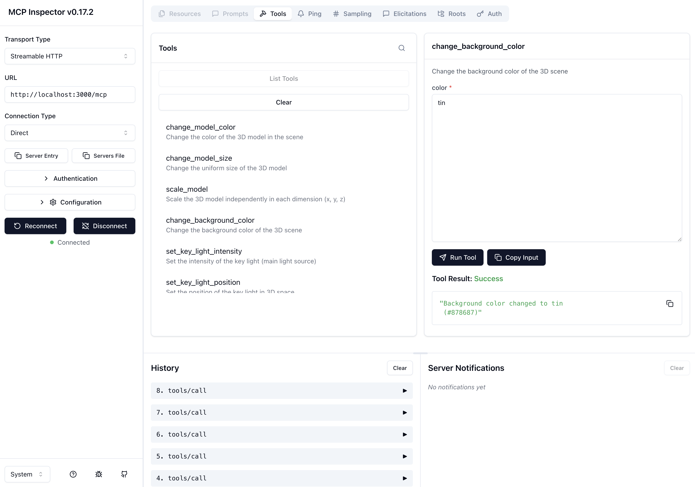

# Testing with MCP Inspector

The MCP Inspector is a developer tool for testing and debugging MCP servers. It provides an interactive web interface to explore server capabilities, test tools, and view resources.



*The MCP Inspector connected to the server, showing tools being tested.*

## Overview

The MCP Inspector allows you to test your MCP server without needing Claude Desktop or other MCP clients. It's perfect for:
- **Development**: Test new tools before packaging
- **Debugging**: Inspect tool responses and server behavior
- **Documentation**: Verify tool schemas and parameters

## Prerequisites

- Node.js (v18 or higher)
- MCP server running (either from source or bundled)
- Frontend application running (optional, for testing actual 3D model changes)

## Testing Options

You can test either the source code (development) or the bundled version (production):

### Option 1: Test Source Code (Development)

1. **Start the server from source:**
   ```bash
   npm start
   # or
   node server.js
   ```
   Server should be running on `http://localhost:3000/mcp`

2. **Start the MCP Inspector:**
   ```bash
   npx @modelcontextprotocol/inspector http://localhost:3000/mcp
   ```

### Option 2: Test Bundled Version (Production)

1. **Build the bundle:**
   ```bash
   npm run build:bundle
   ```
   This creates `dist/hello3dmcp-server.js`

2. **Start the bundled server:**
   ```bash
   npm run start:prod
   # or
   node dist/hello3dmcp-server.js
   ```
   Server should be running on `http://localhost:3000/mcp`

3. **Start the MCP Inspector:**
   ```bash
   npx @modelcontextprotocol/inspector http://localhost:3000/mcp
   ```

## Using the Inspector

### Step 1: Open the Inspector UI

The inspector will start a web interface (usually on `http://localhost:5173`). Open your browser and navigate to the URL shown in the terminal.

### Step 2: Configure the Connection

1. **Transport Type:** Select "Streamable HTTP" (this matches your server's transport)
2. **URL:** Enter `http://localhost:3000/mcp` (note: port 3000, not 3001)
3. **Connection Type:** Select "Direct"
4. Click the **"Connect"** button
5. You should see a green dot and "Connected" status when successful

### Step 3: Browse Available Tools

1. Click on the **"Tools"** tab in the top navigation bar
2. You'll see a list of all available tools in the middle pane:
   - `change_model_color` - Change the color of the 3D model
   - `change_model_size` - Change the uniform size of the model
   - `scale_model` - Scale the model independently in each dimension
   - `change_background_color` - Change the background color of the scene
   - `set_key_light_intensity` - Set the intensity of the key light
   - `set_key_light_position` - Set the position of the key light
   - And many more...

### Step 4: Call a Tool

1. **Select a tool** by clicking on its name in the tools list
2. The right pane will show:
   - Tool description
   - Required and optional parameters
   - Parameter types and descriptions
3. **Enter parameter values** in the input field(s):
   - For `change_background_color`: Enter a color name (e.g., `"tin"`) or hex code (e.g., `"#878687"`)
   - For `change_model_size`: Enter a number (e.g., `2.5`)
   - For `scale_model`: Enter values for x, y, z axes
4. Click the **"Run Tool"** button (paper airplane icon)
5. The result will appear below, showing:
   - Success/failure status
   - Response message
   - Any returned data
6. If your 3D app is running and connected, you'll see the changes reflected immediately

### Step 5: View History

- The bottom-left "History" pane shows all your previous tool calls
- Click on any history entry to see its details
- Use "Clear" to remove history entries

## Example: Changing Background Color

Here's a complete example of testing the `change_background_color` tool:

1. **Select** `change_background_color` from the tools list
2. **Enter** `tin` in the "color" parameter field (or use a hex code like `"#878687"`)
3. **Click** "Run Tool"
4. **Result**: You'll see `"Background color changed to tin (#878687)"`
5. **Visual**: The background in your 3D app will update to the new color (if connected)

## Testing Different Scenarios

### Test Query Tools

Query tools (like `get_model_color`, `get_background_color`) return current state:

1. Select `get_background_color`
2. Click "Run Tool" (no parameters needed)
3. View the returned color value

### Test Relative Operations

Relative operations (like `rotate_model_clockwise`, `dolly_camera_in`) modify state incrementally:

1. Select `rotate_model_clockwise`
2. Enter an angle (e.g., `45`)
3. Run multiple times to see cumulative effects

### Test State-Dependent Operations

Some operations require current state. The server automatically queries state when needed:

1. Select `nudge_model_pitch_up`
2. Enter an angle (e.g., `10`)
3. The server will fetch current rotation before applying the change

## Remote Testing

If you're testing a remote server (e.g., deployed on Railway, Render, etc.), you can connect to it:

```bash
npx @modelcontextprotocol/inspector https://your-server-url.com/mcp
```

Make sure to:
- Use HTTPS for production servers
- Include the `/mcp` endpoint path
- Ensure CORS is properly configured (the server allows all origins by default)

## Troubleshooting

### Connection Fails

- **Check server is running**: Verify `http://localhost:3000/mcp` is accessible
- **Check port**: Make sure you're using port 3000 (MCP endpoint), not 3001 (WebSocket)
- **Check transport**: Use "Streamable HTTP" for HTTP/SSE mode

### Tools Not Appearing

- **Restart the server**: Stop and restart your MCP server
- **Check server logs**: Look for errors in the terminal where the server is running
- **Verify build**: If using bundled version, ensure `npm run build:bundle` completed successfully

### Tool Calls Fail

- **Check parameters**: Verify you're providing the correct parameter types (strings, numbers, etc.)
- **Check frontend**: Some tools require the frontend to be connected via WebSocket
- **Check server logs**: Look for error messages in the server terminal

### Changes Not Reflected in 3D App

- **Verify WebSocket connection**: Make sure your frontend app is connected to the WebSocket server
- **Check session ID**: Ensure the frontend is using the correct session ID
- **Check browser console**: Look for errors in the browser's developer console

## Tips

- **Keep Inspector open**: Leave the Inspector running while developing to quickly test changes
- **Use history**: Review previous tool calls to understand what worked
- **Test edge cases**: Try invalid inputs to see how the server handles errors
- **Compare with Claude**: After testing in Inspector, verify behavior in Claude Desktop matches

## Next Steps

After testing with the MCP Inspector:
1. **Build the package**: Run `npm run build` to create the `.mcpb` file
2. **Install in Claude Desktop**: Follow the installation instructions in the main README
3. **Test in production**: Verify everything works in Claude Desktop as expected
